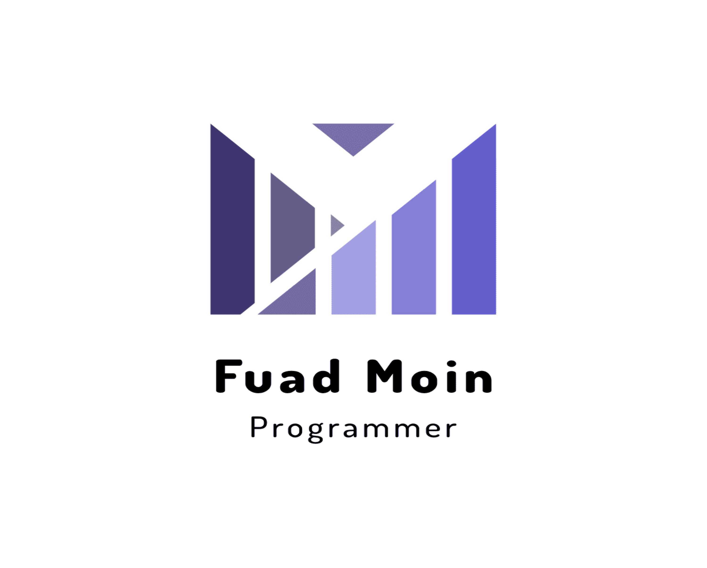

<a name="readme-top"></a>

<div align="center">
  
  
  <br/>

  <h3><b>Hello react front end</b></h3>

</div>

# 📗 Table of Contents

- [📖 About the Project](#about-project)
  - [🛠 Built With](#built-with)
    - [Tech Stack](#tech-stack)
    - [Key Features](#key-features)
- [💻 Getting Started](#getting-started)
  - [Prerequisites](#prerequisites)
  - [Setup](#setup)
  - [Install](#install)
  - [Usage](#usage)
- [👥 Authors](#authors)
- [🔭 Future Features](#future-features)
- [🤝 Contributing](#contributing)
- [⭐️ Show your support](#support)
- [🙏 Acknowledgements](#acknowledgements)
- [📝 License](#license)

# 📖 Hello react front end <a name="about-project"></a>

**Hello react front end** is a simple project that fetchs greeting messages from the [rails](https://github.com/fuadmoin/hello-rails-back-end) API end point.

## 🛠 Built With <a name="built-with"></a>

### Tech Stack <a name="tech-stack"></a>

- **React, Redux, API, and Tailwind**

### Key Features <a name="key-features"></a>

- **Uses redux toolkits**
- **Uses API**
- **Uses Tailwind CSS**

<p align="right">(<a href="#readme-top">back to top</a>)</p>

## 💻 Getting Started <a name="getting-started"></a>

To get a local copy up and running, follow these steps.

### Prerequisites <a name="prerequisites"></a>

In order to run this project you need:

```sh
A Computer
Code editor (VSCode,Atom etc...)
A browser (Chrome,Mozilla,Safari etc...)
Version Control System (Git and Github)
NodeJS (https://nodejs.org/en/)
```

### Setup <a name="setup"></a>

Clone this repository to your desired folder:

```sh
  cd my-folder
  git https://github.com/fuadmoin/hello-react-front-end.git
```

### Install <a name="install"></a>

Install this project with:

```sh
npm install
```

### Usage <a name="usage"></a>

```
  code .
  npm start
```

<p align="right">(<a href="#readme-top">back to top</a>)</p>

## 👥 Author <a name="authors"></a>

👤 **Fuad Abdlemoin**

- GitHub: [@fuadmoin](https://github.com/fuadmoin)
- Twitter: [@Fuad01804580](https://twitter.com/Fuad01804580)
- LinkedIn: [Fuad Moin](https://www.linkedin.com/in/fuadmoin/)

<p align="right">(<a href="#readme-top">back to top</a>)</p>

## 🔭 Future Features <a name="future-features"></a>

- [ ] **[More components will be added]**
- [ ] **[Users will be able to send greeting to the API]**
- [ ] **[Unit tests will be added.]**

<p align="right">(<a href="#readme-top">back to top</a>)</p>

## 🤝 Contributing <a name="contributing"></a>

Contributions, [issues](https://github.com/fuadmoin/hello-react-front-end/issues), and feature requests are welcome!

<p align="right">(<a href="#readme-top">back to top</a>)</p>

## ⭐️ Show your support <a name="support"></a>

If you like this project please consider starring it.

<p align="right">(<a href="#readme-top">back to top</a>)</p>

## 🙏 Acknowledgments <a name="acknowledgements"></a>

I would like to thank Microverse for giving me this chance to work on this awesome project.

<p align="right">(<a href="#readme-top">back to top</a>)</p>

## 📝 License <a name="license"></a>

This project is [MIT](./MIT.md) licensed.

<p align="right">(<a href="#readme-top">back to top</a>)</p>
